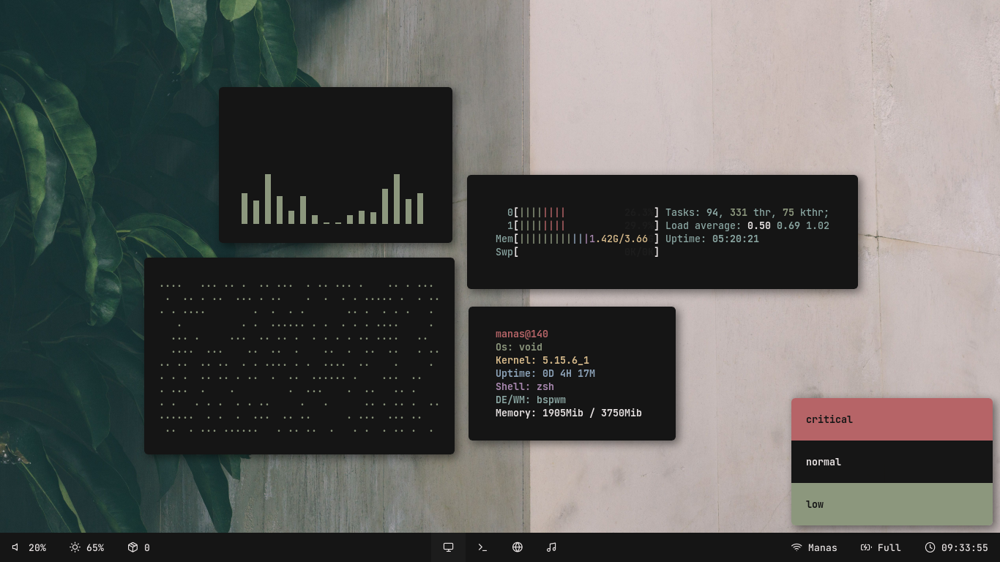
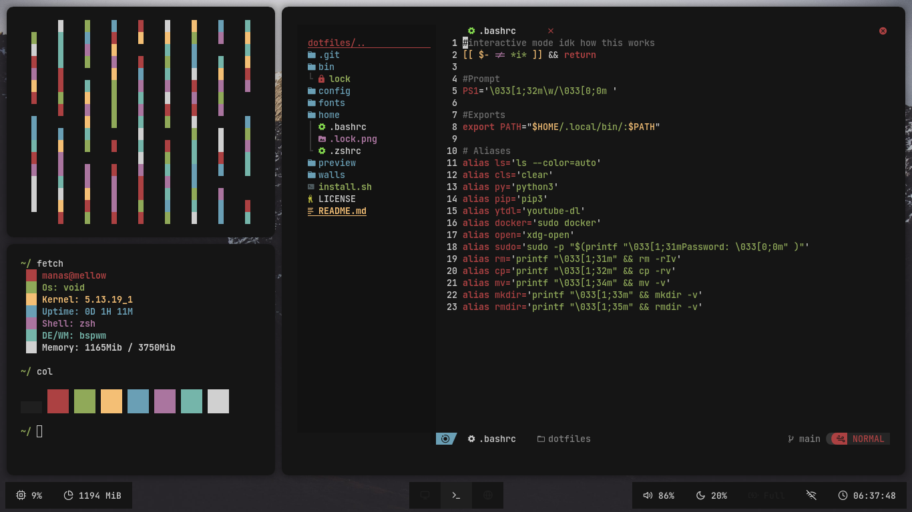
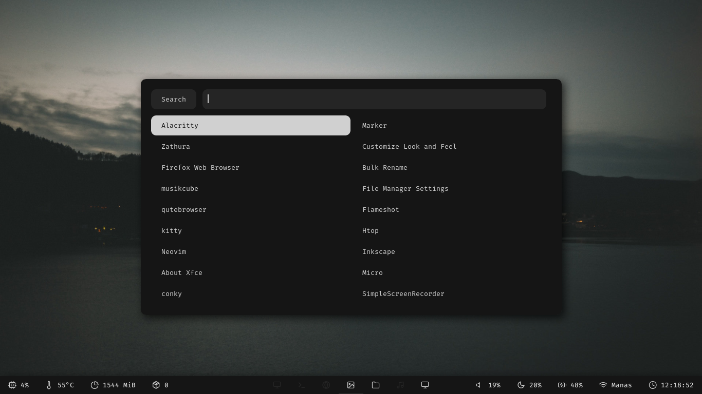
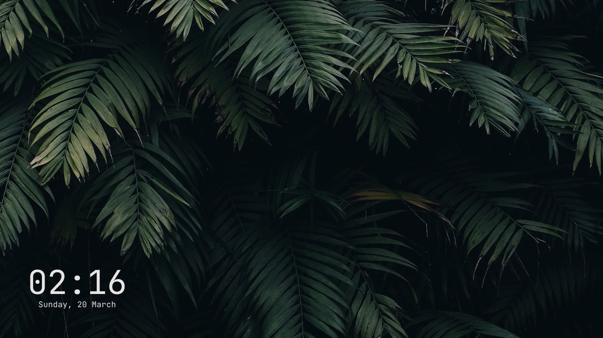

# Dotfiles
dotfiles of Manas140

# Preview
Floating Usage:
<p align="center">
   
</p>

Tiled Usage:
<p align="center"> 
 
</p>

Rofi:
<p align="center">
  
</p>

Lock:
<p align="center">
  
</p>

# Installation
```
  git clone https://github.com/Manas140/dotfiles.git && cd dotfiles
  ./install.sh 
```

# Stuffs In Rice
```
  WM: awesome-wm, bspwm, i3-gaps  
  Bar: polybar
  Compositor: picom-ibhwagan
  AppLauncher: rofi
  Font: Fira-Code, feather
  LockScreen: i3lock-color
  Notification: dunst
  PdfReader: zathura
  Shell: bash, zsh
  Terminal: alacritty, kitty
```

# Others
```  
  ImageViewer: feh, sxiv
  MusicPlayer: musikcube
  Fetch: fetch (https://github.com/Manas140/fetch)
  MusicVisualiser: cava
  ScreenShot: flameshot, maim
  TextEditor: nvim (config: NvChad)
  FileManager: pcmanfm, ranger
```
