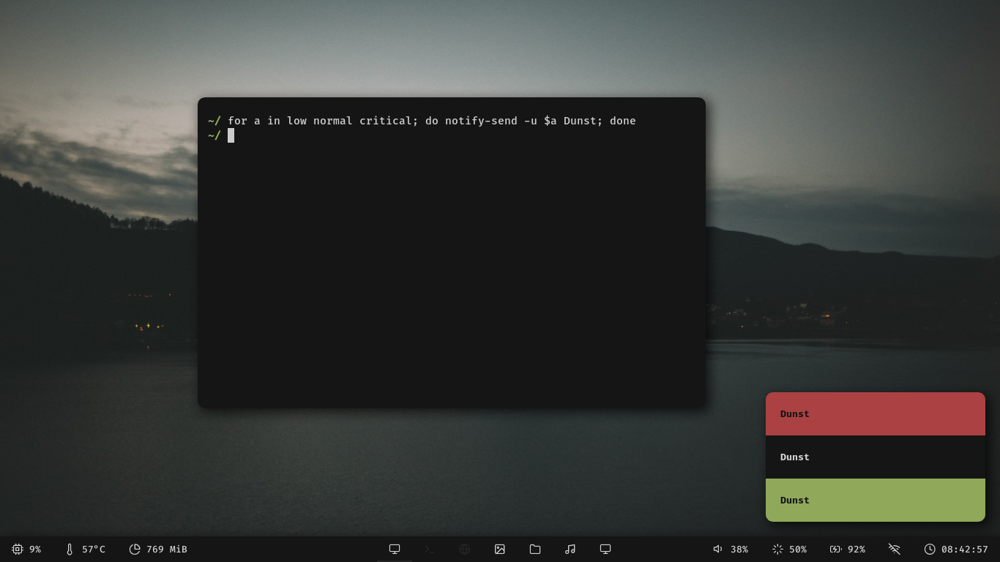

Floating Usage:
<p align="center">
   

Tiled Usage:
<p align="center"> 
 
</p>

Rofi:
<p align="center">
  
</p>

Dunst:
<p align="center">
  
</p>

```
  WM: awesome-wm, bspwm, i3-gaps  
  Bar: polybar
  Compositor: picom-ibhwagan
  MusicPlayer: musikcube
  MusicVisualiser: cava
  PdfReader: zathura
  ImageViewer: feh
  ScreenShot: flameshot
  FileManager: ranger
  Notification: dunst, notify-send
  Terminal: kitty, alacritty
  Font: Fira-Code, feather
  AppLauncher: rofi
  Fetch: [fetch](https://github.com/Manas140/fetch)
  TextEditor: nvim
```
