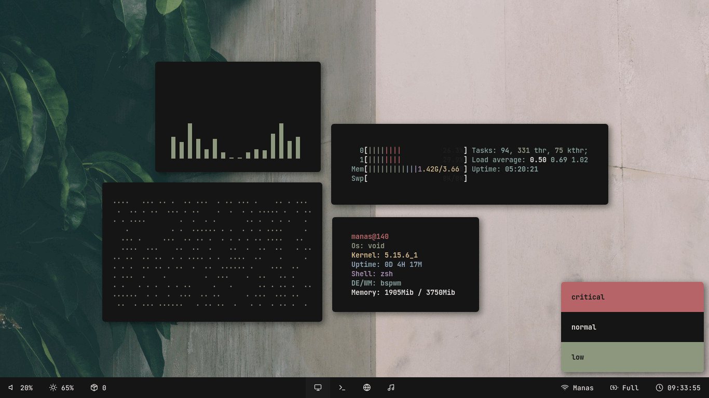

<h1 align="center">Dotfiles</h1>
<h4 align="center">dotfiles by Manas140</h4>

<p align="center">
    <a href="https://github.com/Manas140/dotfiles/stargazers"></a>
    <a href="https://github.com/Manas140/dotfiles/issues"></a>
    <a href="https://github.com/Manas140/dotfiles/network/members"></a>
</p>

<p align="center">
   
</p>

# Installation
```
  git clone https://github.com/Manas140/dotfiles.git && cd dotfiles
  ./install.sh 
```

# KeyBinds
| Key | Action|
| ----- | ----- |
| super + Return | kitty |
| super + r | rofi |
| Print | flameshot |
| super + shift + [1-9] | focus on desktop 1-9 |
| super + shift + l | lock screen (i3 lock) |
| super + shift + e | exit wm |
| super + shift + r | restart wm |
| super + Tab | toggle floating/tiling |
| super + q | kill focused window |
| alt + Tab | toggle window focus |
| super + Arrows [Up,Down,Left,Right] | resize window |
| super + shift + [Up,Down,Left,Right] | swap window |
| super + space | toggle fullscreen |

# Stuffs In Rice
```
  WM: awesome-wm, bspwm, i3-gaps  
  Bar: polybar
  Compositor: picom-ibhwagan
  AppLauncher: rofi
  Font: JetBrains Mono, feather
  LockScreen: i3lock-color
  Notification: dunst
  PdfReader: zathura
  Shell: bash, zsh
  Terminal: alacritty, kitty
```

# Others
<pre><code>  
  ColorScheme: <a href="https://github.com/Manas140/paradise">Paradise</a>
  Fetch: <a href="https://github.com/Manas140/fetch">fetch</a>
  FileManager: pcmanfm, ranger
  ImageViewer: feh
  MusicPlayer: musikcube
  MusicVisualiser: cava
  ScreenShot: flameshot, maim
  TextEditor: <a href="https://github.com/Nvchad">Nvchad</a>
  WebBrowser: Firefox with <a href="https://github.com/migueravila/SimpleFox">SimpleFox UserStyle</a>, Chromium(Just for webDev)
</code></pre>
