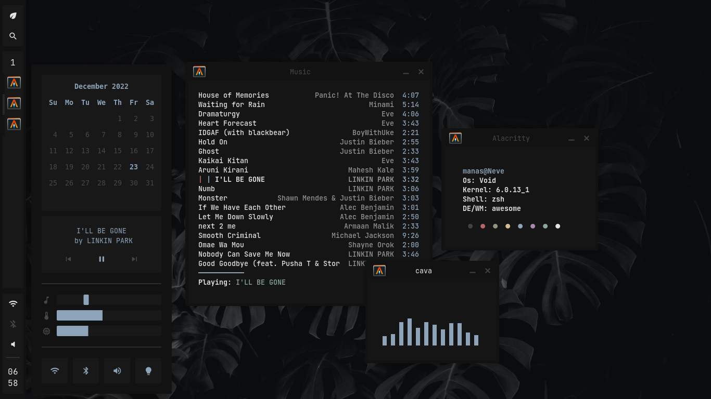

<h1 align="center">AweDots</h1>
<h4 align="center">Config files for AwesomeWm</h4>

<p align="center">
  <a href="https://github.com/Manas140/dotfiles/stargazers"></a>
  <a href="https://github.com/Manas140/dotfiles/issues"></a>
  <a href="https://github.com/Manas140/dotfiles/network/members"></a>
</p>

<p align="center">
  
</p>

## Installation

- <details><summary>Prerequisites</summary>

  > Must have, just to make sure everything works properly

    ```
    awesome bluez elogind flameshot alacritty mpd mpDris2 nmcli picom playerctl pulsemixer redshift rofi xsettingsd zsh
    ```

  > Suggested, makes everything feel complete

    ```
    kitty chromium ncmpcpp nvim lf zathura
    ```

- Clone the repo

  ```
  git clone --recurse-submodules https://github.com/Manas140/dotfiles.git --depth=1 && cd dotfiles
  ```

- Install / Copy all configs

  ```
  ./install.sh 
  ```

</details>

## Usage [ Keybinds ] 
| Key                                  | Action                     |
| -----                                | -----                      |
| **[Software]**                       | **Action**                 |
| Print                                | flameshot gui              |
| Super + r                            | rofi                       |
| Super + Return                       | alacritty                  |
|                                      |                            |
| **[AwesomeWm]**                      | **Action**                 |
| Super + d                            | open dashboard             |
| Super + q                            | kill focused window        |
| Alt + Tab                            | toggle window focus        |
| Super + m                            | minimize focused window    |
| Super + Tab                          | toggle floating/tiling     |
| Super + space                        | toggle fullscreen          |
| Super + [1-5]                        | focus desktop 1-5          |
| Super + Shift + [1-5]                | move window to desktop 1-5 |
| Super + Arrow [Up,Down,Left,Right]   | resize window              |


## Project references
  - Colorscheme: [Paradise-theme](https://github.com/paradise-theme)
  - Fetch: [Fetch](https://github.com/manas140/fetch)
  - Firefox: [SimpleFox](https://github.com/migueravila/SimpleFox)
  - Nvim: [Conscious](https://github.com/manas140/conscious)

## Special Thanks

  - [Rklyz](https://github.com/rklyz)
  - [Harry](https://github.com/saimoomedits)
